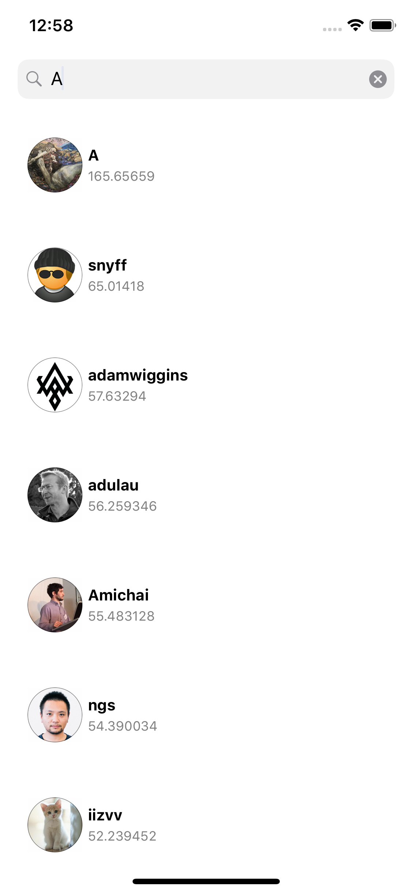

# Github-UserList-Texture

### About this Service
- GitHub Search User Api를 이용하여 특정 사용자 목록을 보여줍니다.
- MVVM 패턴과 RxSwift를 이용하여 작성하였습니다.
- Texture 라이브러리를 이용하여 UI를 작성하였습니다.

- SearchBar에 입력한 내용을 기준으로 사용자를 검색합니다.
- 사용자에 대한 프로필 이미지, 이름, 점수를 표시해줍니다.
- 검색된 사용자는 Header Field에 내려오는 링크로 단방향 페이징 됩니다.

### Library
- Texture
- RxSwift
- RxCocoa
- RxCocoa_Texture
- RxAlamofire
- RxOptional
- SnapKit

